### flex 정렬 (flex-container) 


flex란, 하나의 flex-item이 자신의 컨테이너가 차지하는 공간에 맞추기 위해 크기를 키우거나 줄이는 방법을 설정하는 속성이다. 

flex는 대게 부모를 flex-container, 자식을 flex items 라고 구분짓는다

아래와 같이 span들을 감싸는 div는 flex-container , span들은 각각 flex items 가 되겠다. 

(flex 는 실무에서 굉장히 유용하게 사용했던 css 속성인데,  브라우저별로 호환되지 않을 수 있으니 접두어는 꼭 함께 써주자! )

```html
<div> <!-- flex container -->
    <span> flex items </span>
    <span> flex items </span>
    <span> flex items </span>
</div>
```


### 1. display

대게 display: flex 를 사용하면 한 줄에 모든 요소들이 정렬된다.  inline-fllex 는 한 줄에 정렬은 되지만 인라인 요소와 같이 사용할 수 있다는 뜻. 일반적으론 대게 display: flex 를 사용한다.  

★ flex container에 대한 특성일 뿐, flex container 안의 flex items 과는 무관하다! ★

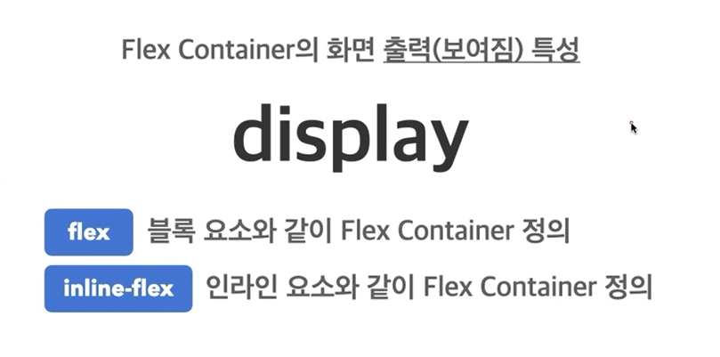


##### 1) display: flex 

블록 요소로 flex container이 나열됨. 

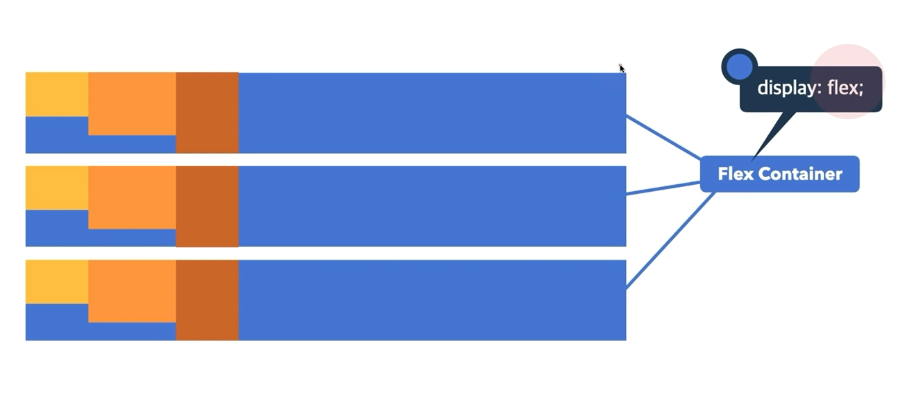


##### 2) display: inline-flex

인라인블록 요소로 flex container이 나열됨. 

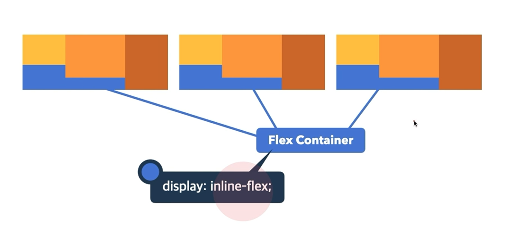


### 2. flex-direction

플렉스 컨테이너 내의 아이템을 배치할 때 사용할 주축 및 방향(정방향, 역방향)을 지정함. 

row 는 수직, column 은 수평이라 생각하면 된다. 

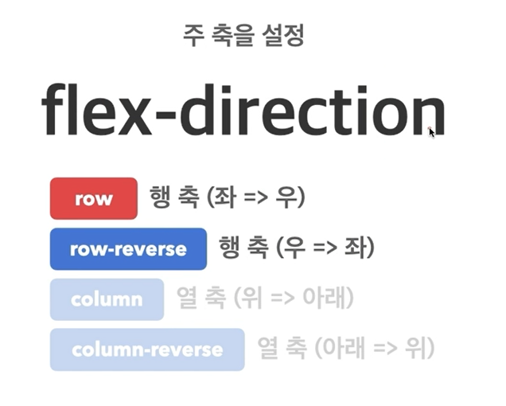


#### 1) row , row-reverse 

display:flex 는 flex-container 가 블록 요소이므로 width :100% 이고, row 는 수직 정렬 방식을 정함. 

기본 요소는 row 이며 왼 > 오른쪽 정렬

row-reverse 는 row의 역방향, 오른쪽 > 왼쪽 정렬

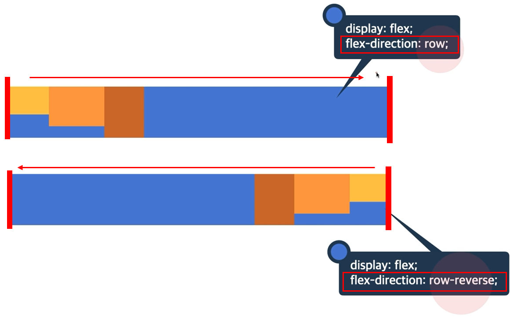


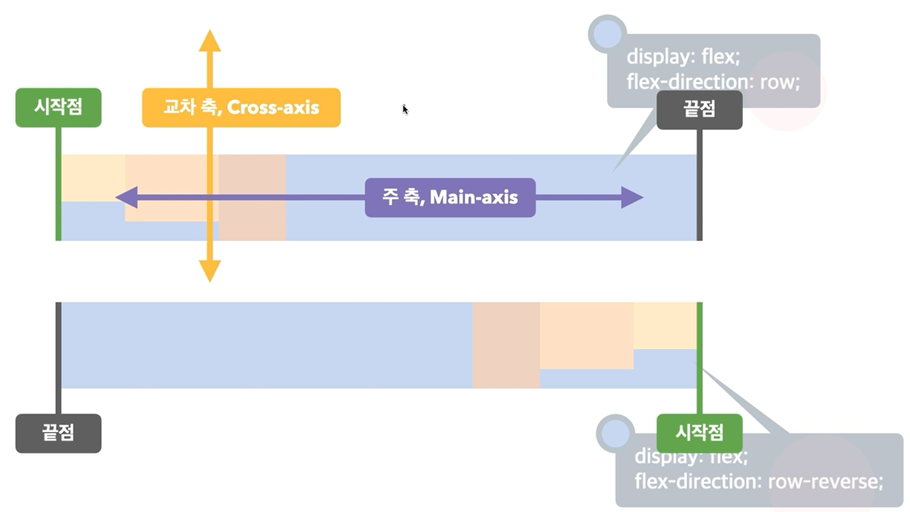


#### 2)  column, column-reverse 

column 은 수평 정렬(행열 중에 열 정렬)을 뜻 함. 

column 은 위 > 아래 정렬

column-reverse 는 아래 > 위 정렬 .

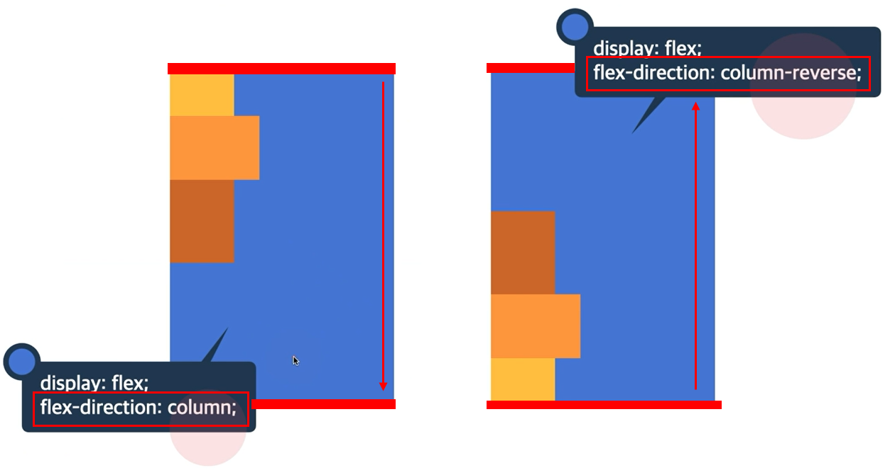


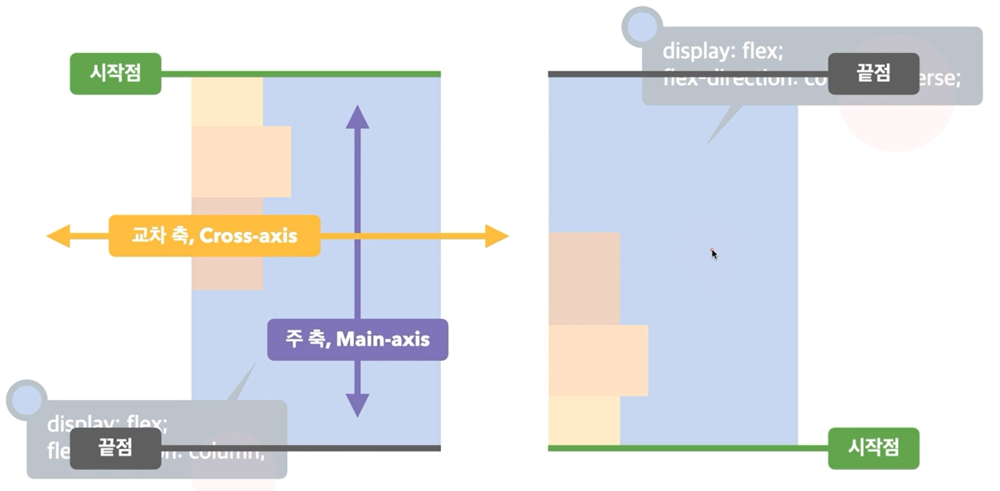


### flex-wrap

`flex-item` 요소들이 강제로 한줄에 배치되게 할 것인지, 또는 가능한 영역 내에서 벗어나지 않고 여러행으로 나누어 표현 할 것인지 결정하는 속성이다. 만약 영역 내에서 벗어나지 못하게 설정한다면, 동시에 요소의 방향 축을 결정할 수 있다. 

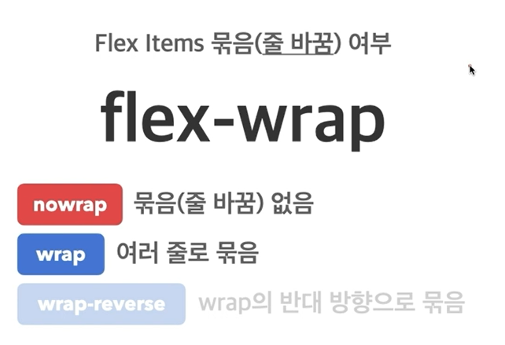


#### 1) nowrap, wrap 

nowrap 은 대게 한 줄로 표현하고자 할 때 사용하고, wrap은 여러 줄로 표현하고자 할 때 사용한다. 

만약 아래와 같이 파란색 div안에 주황색 요소들이 있다고 가정해보자. 

왼쪽 그림은 flex-wrap:nowrap 인 기본 값으로, 한 줄로 주황색 요소들을 나열하기 위해 요소들의 width 값이 100px 인데도 불구하고 쭈그러든 것을 알 수 있다. 


오른쪽 그림은 flex-wrap:wrap 으로, 만약 파란색 부모 div 요소의 가로 길이보다 자식 주황색 요소들의 width가 클 경우, 부모 width 를 넘지 않는 선에서 자식 요소들을 한 줄로 배치하고, 나머지는 아랫줄로 내려보낸다.  

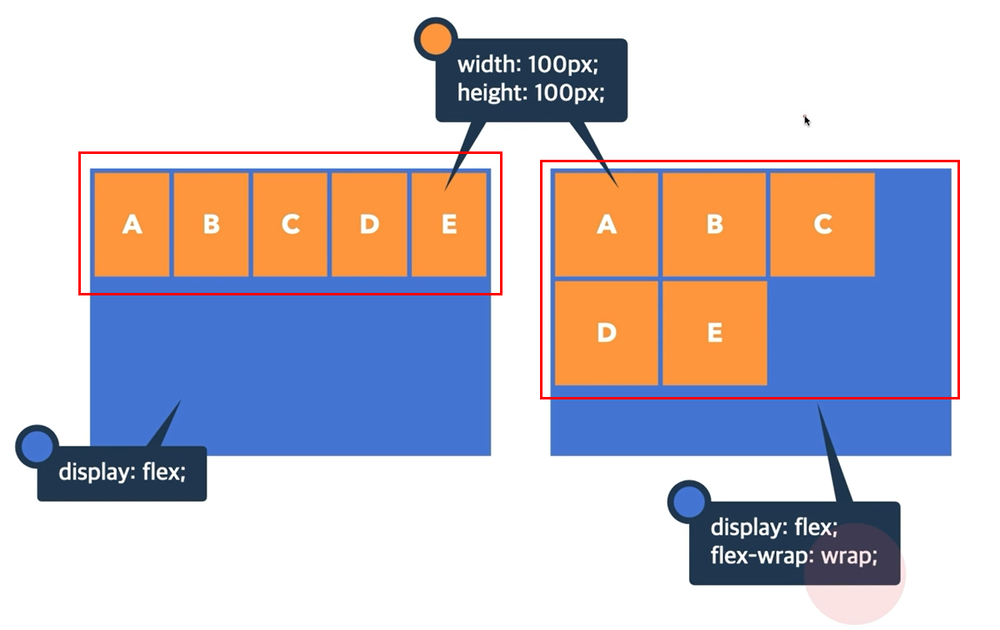


### 4. justify-content

브라우저 사이와 함께 주위의 콘텐츠 항목의 공간을 배포하는 방법 속성을 정의한다. 즉, 부모 요소(flex-container)와 자식 요소(flex-items)간의 공간 배포 방식을 표현함!


#### 1) flex-start, flex-end, center 

flex-start : 기본 값으로.  flex-container 을 기준으로 flex-items를 왼쪽으로 정렬을 말한다. 

flex-end : flex-container 을 기준으로 flex-items 를 오른쪽으로 정렬한다. 

center : flex-container 을 기준으로, flex-items 를 가운데로 정렬한다. 

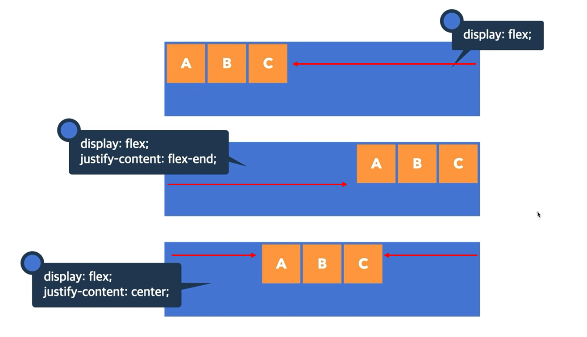


#### 2) space-between, space-around 

space-between : flex-container를 기준으로, container의 양쪽 여백이 남지 않게 하여금, flex-items 들이 균등하게 배열된다. 

space-around: flex-container를 기준으로, flex-items 들이 양쪽 여백을 균등하게 갖고 배열된다, 


space-between

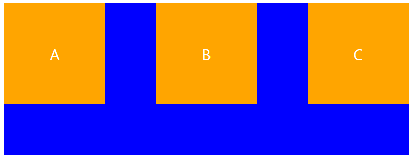


space-around

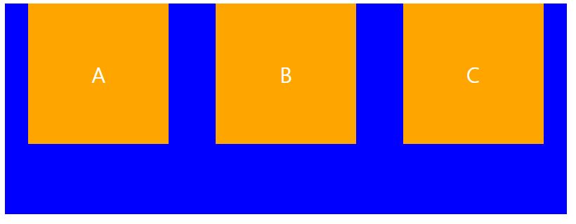


### 5. align-content

콘텐츠 사이와 콘텐츠 주위 빈 공간을 [플렉스박스](https://developer.mozilla.org/ko/docs/Web/CSS/CSS_Flexible_Box_Layout)의 교차축, [그리드](https://developer.mozilla.org/ko/docs/Web/CSS/CSS_Grid_Layout)의 블록 축을 따라 배치하는 방식을 결정합니다. 즉, 콘텐츠의 수직 정렬 방식을 얘기한다. 여기서 명심할 것은 **여러 줄** 정렬 방법이라는 것! 

### 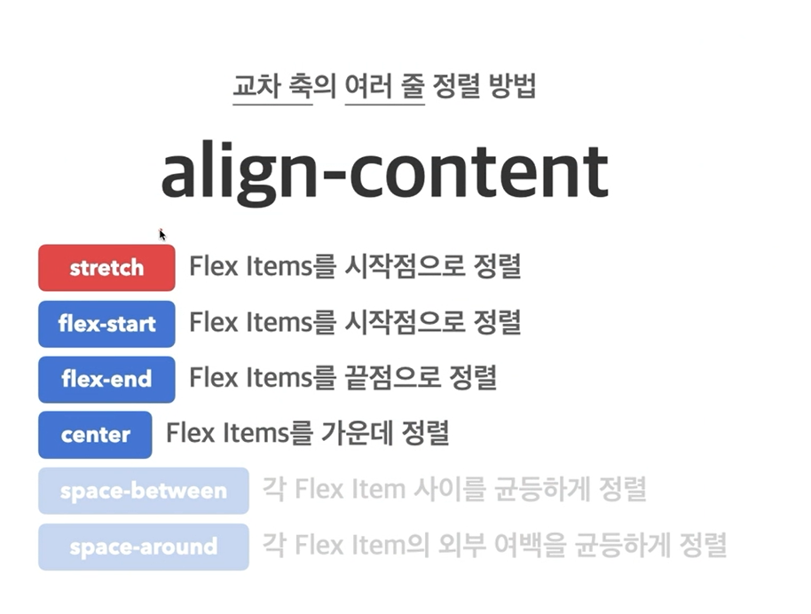


#### 1) stretch, flex-start, flex-end, center 

수직정렬 방식

stretch : 기본 defalut 값. flex-items 의 시작점부터 정렬. (첫 번째 그림은 height 값이 명시되어있지 않아 요소에 맞게 늘어난 그림. 두번째 그림은 height 값이 명시되어 있고, 기본 값 stretch 인 상태 )

flex-start :  flex-items 의 시작점부터 정렬함. 위에서부터 정렬.(세번째 그림으로 시작점부터 나열)

flex-end : flex-items 의 끝점부터 정렬함. 아래서부터 정렬 

center : flex-container 에서 flex-itmes 들이 수직에서 가운데에 정렬 .  


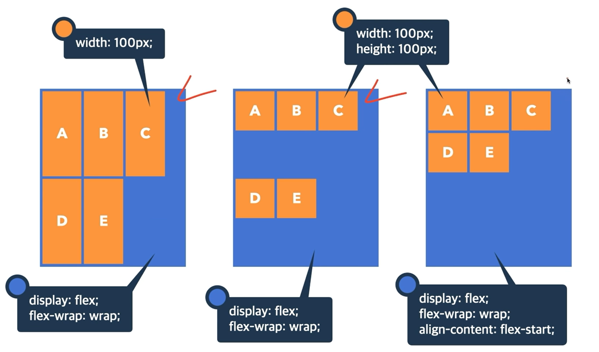

####  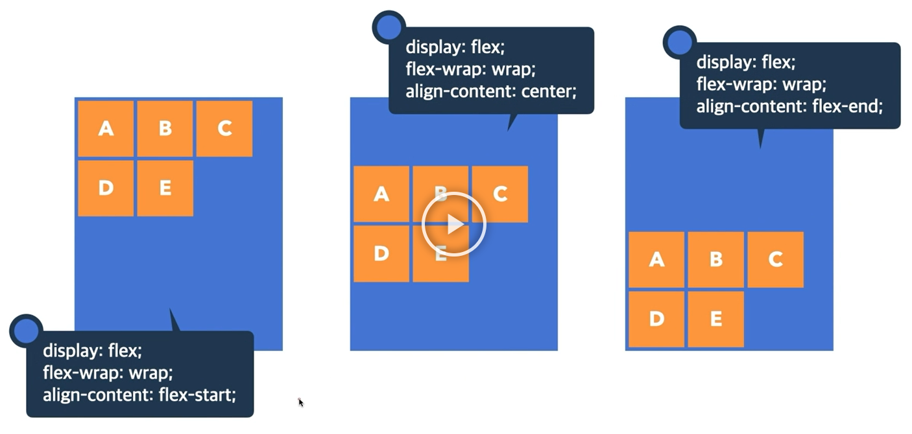


#### 2) space-between, space-around

space-between : 요소들의 여백이 균등하게 분배되며, container의 위 아래 여백없이 flex-items 들이 분배된다. 

space-around : 요소들의 여백이 균등하게 분배되며, container 의 위 아래 여백은 모든 flex-items의 여백과 동일한 여백을 갖는다. 


space-between

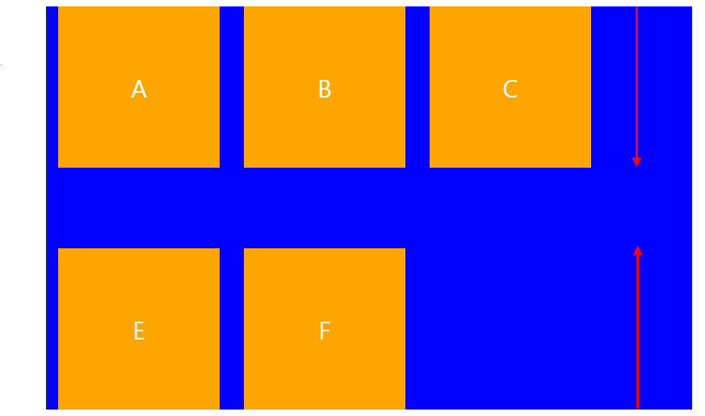


space-around

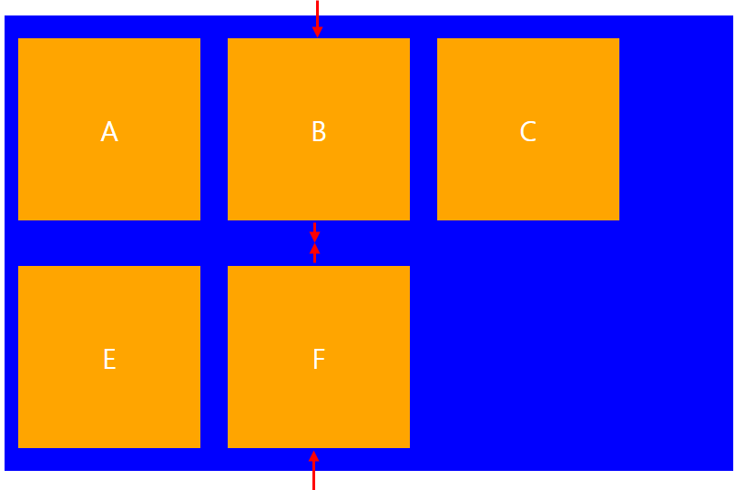


### 6. align-items 

flex-items 요소들의 **한 줄**로 정렬되는 방법

만일, flex-items 가 여러 줄일 경우, align-items 보단 align-content 를 사용하는 것이 효과적이다! 


#### 1) stretch, flex-start, flex-end (여러줄일 경우)

flex-wrap: wrap 인 경우를 가정해서 예를 들어보자. 

stretch : 아래의 그림과 같이 items 들이 두 줄로 되어 있을 때, height 값 이 따로 명시하지 않았으므로, height: auo 이고, 나열은 stretch 기본값으로 된다. 

flex-start : 각각 줄의 시작점을 기준으로 나열된다. 

flex-end : 각각 줄의 끝점 기준으로 나열된다. 

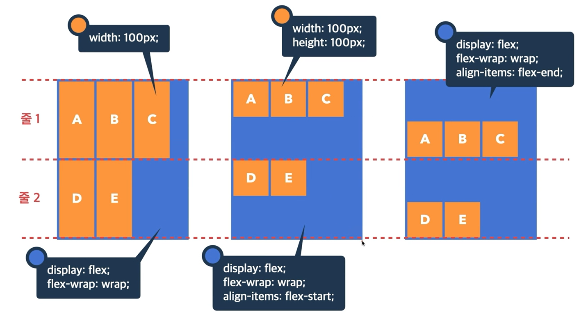


#### 2) stretch, flex-start, flex-end (한 줄일 경우)

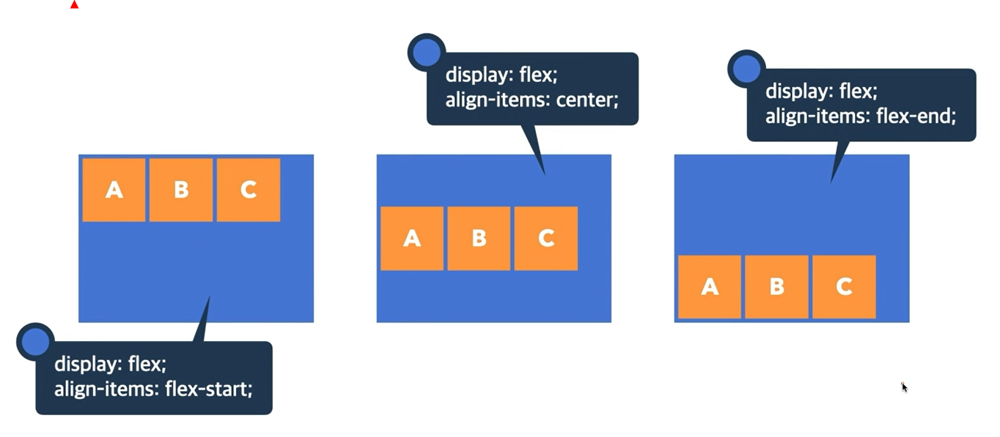


#### 3) center, basline (여러줄일 경우)

center : flex-items 들이 위아래 기준으로 가운데에 정렬됨. 

baseline : flex-items 들이 위아래 기준으로 base line 에 정렬됨. 

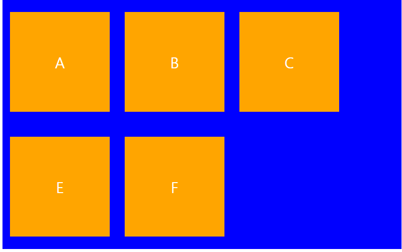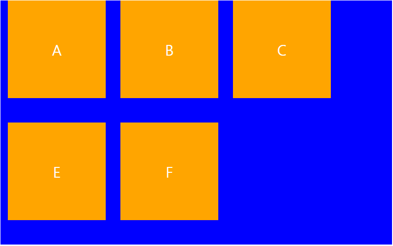


#### 4) center, basline (한 줄일 경우)

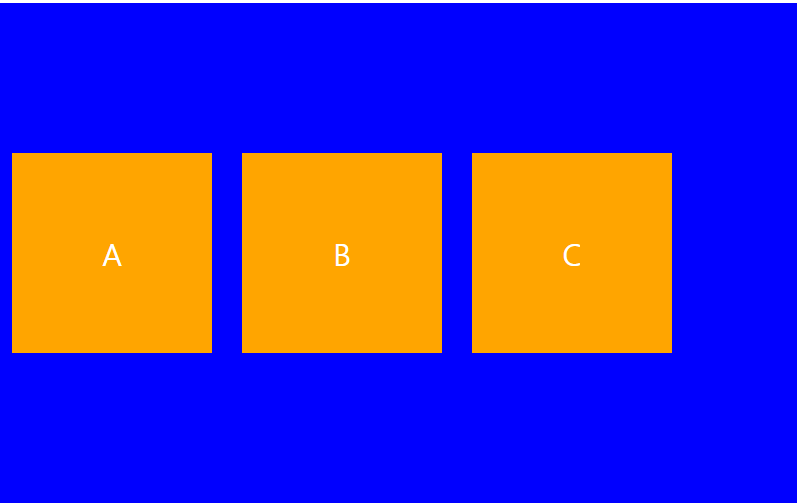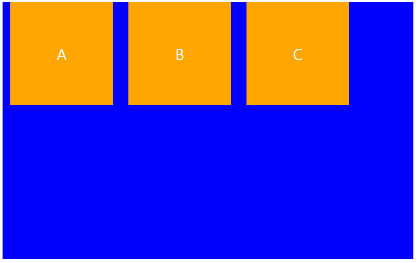