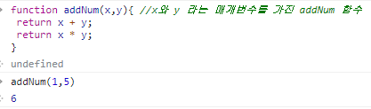
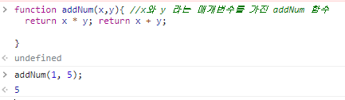

### 함수(function)

#### 기명(이름 있는) 함수	

- 함수(function)란 하나의 특별한 목적의 작업을 수행하도록 설계된 독립적인 블록

- 이러한 함수는 필요할 때마다 호출하여 해당 작업을 반복하여 수행할 수 있음. 

  ```html
  function testFunc(){
  	console.log('함수');
  }
  ```

- 자바스크립트에서 함수 정의하는 문법은 아래와 같다. 

  ```html
  function 함수이름(매개변수1, 매개변수2){
  	함수가 호출되었을 때 실행하고자 하는 실행문; 
  }
  ```


#### 익명(이름이 없는) 함수

- 이름이 없는 함수는 대개 함수를 선언한다라 하지 않고, 함수를 **표현** 한다고 한다! 

- 변수에 함수를 할당하여 사용 함.

  ```html
  let func  = function (){
  	console.log('익명 함수');
  }
  
  //함수를 호출할 때는 기명 함수 처럼 똑같이 괄호를 붙여 호출한다. 
  func(); // func 함수 호출
  ```

  


### 매개변수 & 인수

- 매개변수란 함수 정의에서 전달받은 인수를 함수  내부로 전달하기 위해 사용하는 변수

- 인수란 함수가 호출될 때 함수로 값을 전달해주는 값을 의미함. ( = 데이터 )


``` html
function test(a,b){ //a와 b 라는 매개변수를 갖고 있는 test 함수 
	return a + b ;
}

test(1,3);  //인수로 1과 3을 함수에 전달하여 함수 호출 ==> 4
test(15,5); //인수로 15과 5을 함수에 전달하여 함수 호출 ==> 20
test(25,6); //인수로 25과 6을 함수에 전달하여 함수 호출 ==> 31
```


### 메소드

- 하나의 함수를 뜻한다. 메소드를 호출하는 것은 함수를 호출하는 것과 같은데, 다만 그 함수가 어떤 객체의 속성으로 들어가 있어서 구분짓기 위해 메소드라 부른다.


### 반환문(return)

- 자바스크립트에서 함수는 반환문을 포함할 수 있음 

- 이러한 반환문을 통해 호출자는 함수에서 실행된 결과를 전달받을 수 있음. 

- 함수 실행 중 반환문이 나오면 반환문 하단의 실행은 모두 중단하고, return 키워드 다음에 명시된 표현식의 값을 반환한다. 

  - 예시1)

  ```html
  function addNum(x,y){ //x와 y 라는 매개변수를 가진 addNum 함수
   return x + y; 
   return x * y;
  }
  
  addNum(1,3);  // 인수 1,3 을 addNum 함수에 전달하여 값 4 반환
  //return x+ y ; 실행문 이후의 하단 실행문은 실행하지않는다. 
  
  ```
  
  - 예시2) 
  
  - addNum 함수 안에는 return x+y 와 return x*y 두 실행문이 있지만, addNum(1,5) 를 실행하였을 때 x+y 값으로 반환하여 보여줌. 
  
    
  
  - 예시3) 
  
  - 순서를 바꾸어 return x*y 와 return x+y  순서로 작성하였을 때, addNum(1,5)를 실행하면 x**y 값을 반환함. 
  
    


