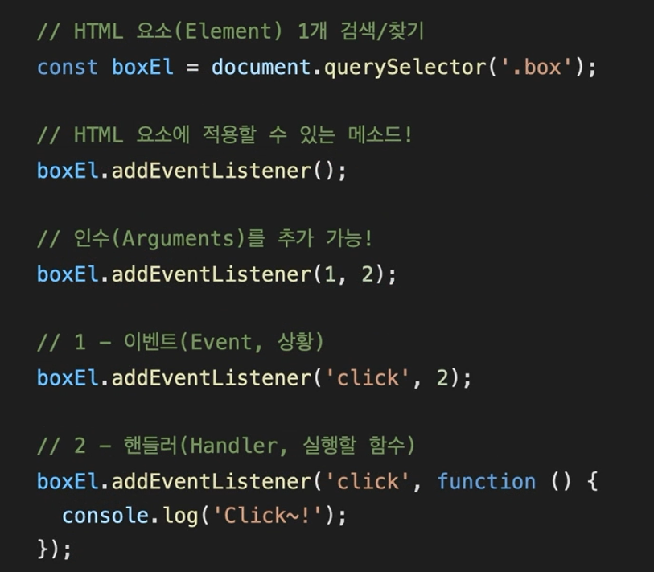
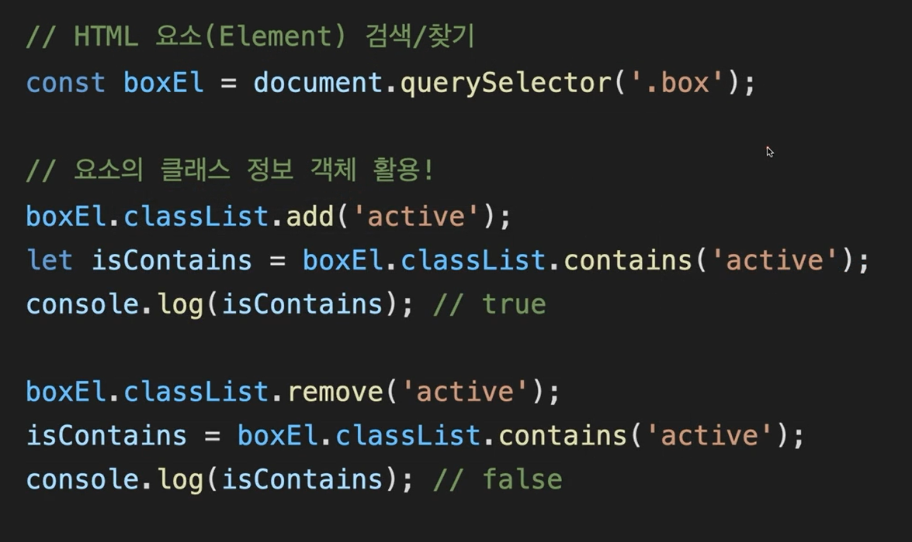
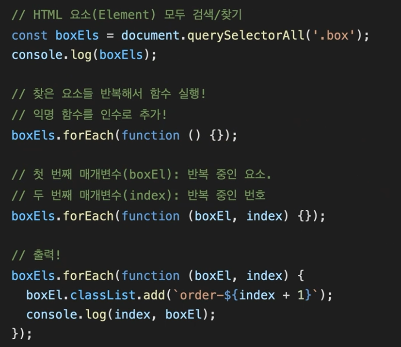
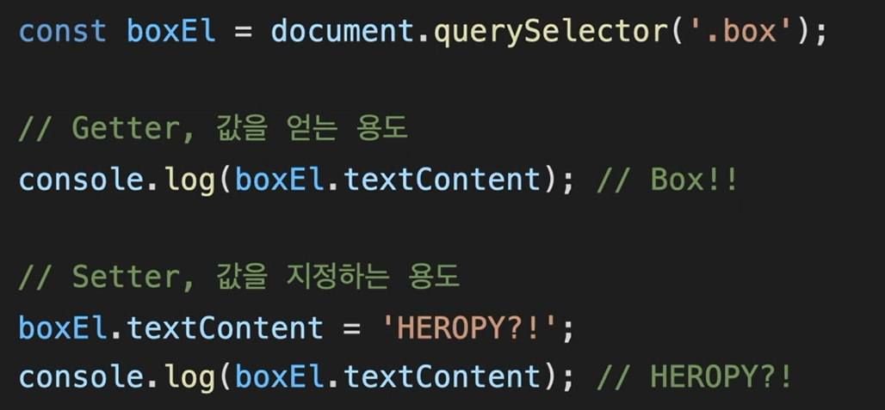
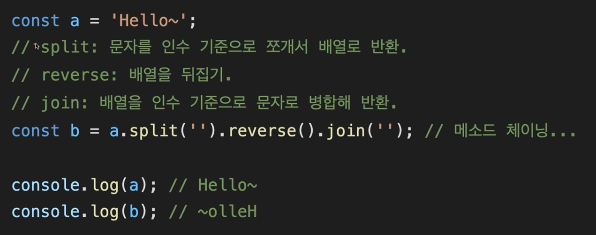

### DOM API

- Document Object Model , Application Programming Interface 의 약어. 
- object model 이란 div, span, input 과 같은 객체를 뜻하고 document는 html에 들어있는 object model 들을 뜻함. 
- API 는 웹사이트가 동작하기 위해 입력하는 프로그래밍 명령.
- 즉, 자바스크립트에서 HTML을 제어하는 여러가지 명령들 !  (내가 작성한게 아닌 원래부터 작성되어져 있음)
- - DOM API 예시)
  - 

- - 
  - 
  - 

### 메소드 체이닝

- 메소드가 체인처럼 연결되어 사용되는 것 = 메소드들을 이어 붙여서 사용할 수 있음! 

- - 예시)
  
    